# Diagrama de Clases - MiCuentaBE

Copia el siguiente código en [mermaid.live](https://mermaid.live) para visualizar y descargar el diagrama.

```mermaid
classDiagram
    %% Domain Models
    class User {
        -Long id
        -String name
        -String lastname
        -String email
        -String passwordHash
    }

    class Category {
        -Long id
        -String name
        -MovementType type
        -Long userId
    }

    class Movement {
        -Long id
        -Long userId
        -BigDecimal amount
        -LocalDate date
        -MovementType type
        -Long categoryId
        -String description
        -LocalDateTime createdAt
        -LocalDateTime lastModifiedAt
    }

    class Budget {
        -Long id
        -BigDecimal amountLimit
        -Integer month
        -Integer year
        -Long categoryId
        -Long userId
    }

    class MovementType {
        <<enumeration>>
        INCOME
        EXPENSE
    }

    %% REST Controllers
    class UserController {
        -GetCurrentUserUseCase getCurrentUserUseCase
        +me(Authentication): UserResponse
    }

    class CategoryController {
        -CreateCategoryUseCase createCategoryUseCase
        -GetCategoriesUseCase getCategoriesUseCase
        -DeleteCategoryUseCase deleteCategoryUseCase
        +create(Category, Authentication): Category
        +list(MovementType, Authentication): List~Category~
        +delete(Long): void
    }

    class MovementController {
        -RegisterIncomeUseCase registerIncomeUseCase
        -RegisterExpenseUseCase registerExpenseUseCase
        -UpdateMovementUseCase updateMovementUseCase
        -DeleteMovementUseCase deleteMovementUseCase
        -ListIncomesUseCase listIncomesUseCase
        -ListExpensesUseCase listExpensesUseCase
        -ListMovementsUseCase listMovementsUseCase
        +registerIncome(CreateMovementRequest, Authentication): MovementResponse
        +registerExpense(CreateMovementRequest, Authentication): MovementResponse
        +update(Long, UpdateMovementRequest, Authentication): MovementResponse
        +delete(Long, Authentication): void
        +listIncomes(LocalDate, LocalDate, Authentication): MovementsListResponse
        +listExpenses(LocalDate, LocalDate, Authentication): MovementsListResponse
        +list(LocalDate, LocalDate, Authentication): MovementsListResponse
    }

    class BudgetController {
        -CreateBudgetUseCase createBudgetUseCase
        +create(CreateBudgetRequest, Authentication): ResponseEntity~BudgetResponse~
    }

    %% Use Cases
    class RegisterUserUseCase {
        +execute(String, String, String): UserResponse
    }

    class LoginUserUseCase {
        +execute(String, String): TokenResponse
    }

    class GetCurrentUserUseCase {
        +execute(String): UserResponse
    }

    class CreateCategoryUseCase {
        +execute(String, String, MovementType): Category
    }

    class GetCategoriesUseCase {
        +execute(String, MovementType): List~Category~
    }

    class DeleteCategoryUseCase {
        +execute(Long): void
    }

    class RegisterExpenseUseCase {
        +execute(String, CreateMovementRequest): MovementResponse
    }

    class RegisterIncomeUseCase {
        +execute(String, CreateMovementRequest): MovementResponse
    }

    class ListMovementsUseCase {
        +execute(String, LocalDate, LocalDate): MovementsListResponse
    }

    class ListExpensesUseCase {
        +execute(String, LocalDate, LocalDate): MovementsListResponse
    }

    class ListIncomesUseCase {
        +execute(String, LocalDate, LocalDate): MovementsListResponse
    }

    class UpdateMovementUseCase {
        +execute(Long, String, UpdateMovementRequest): MovementResponse
    }

    class DeleteMovementUseCase {
        +execute(Long, String): void
    }

    class CreateBudgetUseCase {
        +execute(String, CreateBudgetRequest): BudgetResponse
    }

    %% DTOs
    class UserResponse {
        -Long id
        -String name
        -String lastname
        -String email
    }

    class MovementResponse {
        -Long id
        -BigDecimal amount
        -LocalDate date
        -String description
        -String categoryName
    }

    class BudgetResponse {
        -Long id
        -BigDecimal amountLimit
        -Integer month
        -Integer year
    }

    %% Relationships
    User "1" --> "*" Category
    User "1" --> "*" Movement
    User "1" --> "*" Budget
    Category "1" --> "*" Movement
    Category "1" --> "*" Budget
    Movement --> MovementType
    
    UserController --> GetCurrentUserUseCase
    UserController --> UserResponse
    
    CategoryController --> CreateCategoryUseCase
    CategoryController --> GetCategoriesUseCase
    CategoryController --> DeleteCategoryUseCase
    CategoryController --> Category
    
    MovementController --> RegisterIncomeUseCase
    MovementController --> RegisterExpenseUseCase
    MovementController --> UpdateMovementUseCase
    MovementController --> DeleteMovementUseCase
    MovementController --> ListIncomesUseCase
    MovementController --> ListExpensesUseCase
    MovementController --> ListMovementsUseCase
    MovementController --> MovementResponse
    
    BudgetController --> CreateBudgetUseCase
    BudgetController --> BudgetResponse
    
    RegisterUserUseCase --> User
    RegisterUserUseCase --> UserResponse
    LoginUserUseCase --> User
    GetCurrentUserUseCase --> User
    GetCurrentUserUseCase --> UserResponse
    
    CreateCategoryUseCase --> Category
    GetCategoriesUseCase --> Category
    
    RegisterExpenseUseCase --> Movement
    RegisterExpenseUseCase --> MovementResponse
    RegisterIncomeUseCase --> Movement
    RegisterIncomeUseCase --> MovementResponse
    ListMovementsUseCase --> Movement
    ListMovementsUseCase --> MovementResponse
    UpdateMovementUseCase --> Movement
    UpdateMovementUseCase --> MovementResponse
    
    CreateBudgetUseCase --> Budget
    CreateBudgetUseCase --> BudgetResponse
```

## 🔗 Instrucciones para descargar como imagen:

1. Ve a **[mermaid.live](https://mermaid.live)**
2. **Pega el código anterior** en el editor
3. Haz clic en el **icono de descarga** (esquina superior derecha)
4. Elige el formato: PNG, SVG o PDF
